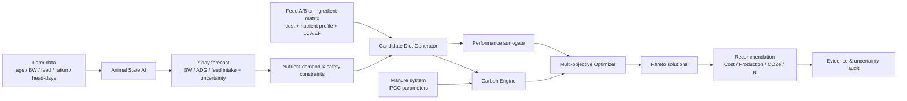
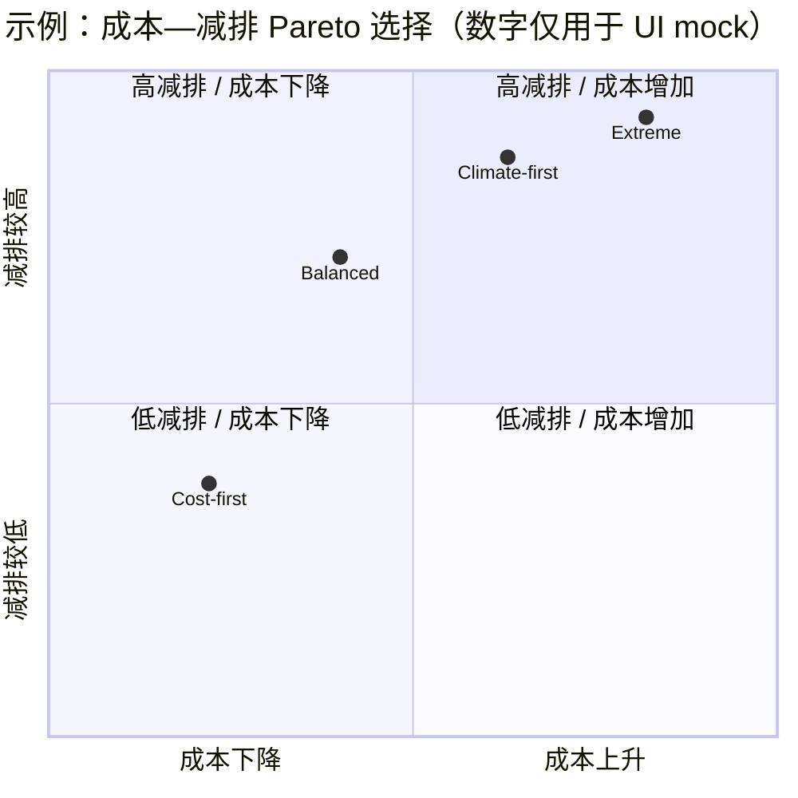
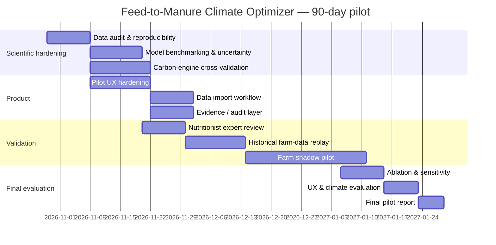

> **历史草稿（2026-09-29）。** 文中“首版暂不加入预测”等说法已经过时。当前版本见 [README](../../README.md) 与 [首版范围](../../Feed2Climate-MVP-首版范围.md)。本文件仅供追溯，不是提交材料。

# AI4Climate 参赛方案：AI 驱动的低碳畜牧精准营养与粪污管理九十天 Demo 设计

> **执行范围更新（2026-09-29）：首版暂不加入预测。** 当前按 [Feed2Climate 首版 Demo 范围](../../Feed2Climate-MVP-首版范围.md) 推进：当前状态 → 营养供需检查 → 可行日粮比较 → 成本与模型化排放差异。下文保留为原始研究稿，其中关于未来七天预测、生产响应代理模型、预测训练与对应演示脚本的内容不再作为首版任务；预测仅保留为后续可选研究方向。AI 的具体贡献仍需另行论证，不能把配方优化或碳公式直接当作已验证的 AI 效果。

## 执行摘要

### 核心结论

这个项目**可以成为一个很正的 AI + Climate mitigation 项目**，但前提是不要把它做成“畜牧业碳排放计算器”，也不要一开始声称能够同时优化牛、猪、鸡所有生产系统。

最有竞争力的产品定义是：

> **Feed-to-Manure Climate Optimizer**  
> 一个面向畜牧营养师和生产管理者的决策系统：利用养殖场本来就有的体重、采食、日龄、日粮与粪污管理数据，预测下一阶段动物的营养/生产需求，并在**生产性能、饲料成本和温室气体排放之间自动寻找最优方案**。

它的逻辑是：

\[
\text{动物状态}
\rightarrow
\text{AI需求预测}
\rightarrow
\text{动态日粮优化}
\rightarrow
\text{Feed use / N / VS变化}
\rightarrow
\text{CH}_4,\text{N}_2\text{O},\text{feed CO}_2e
\rightarrow
\text{低碳推荐}
\]

其中最重要的设计原则是：

> **AI 不负责“算碳”。AI 负责预测动物状态和生产响应；碳核算由 IPCC / FAO / LCA 的透明公式负责；优化器负责寻找成本—生产—排放之间的 Pareto 最优解。**

这会比“让一个大语言模型告诉农场怎么减排”科学得多，也更容易向评委证明 **AI is necessary**。

**建议首个 pilot species 选生长育肥猪（grow–finish pigs）**，但底层架构从第一天就按照 livestock-wide 设计。原因不是猪比牛、鸡更重要，而是猪在“数据可获得性 × 已发表减排证据 × AI 必要性 × 90 天 Demo 可行性”之间目前平衡最好。2024 年 Journal of Animal Science 的生命周期评价直接比较传统三阶段群体饲喂与 individual precision feeding，后者在生长育肥阶段使 GWP 降低 **7.6%**，酸化潜势降低 16.2%，富营养化潜势降低 13.0%；论文采用的精准饲喂本身就是每天根据动物需要混合两种基础日粮 A/B，这非常适合直接复现成 Demo。citeturn18view3

更重要的是，有一个公开 Zenodo 数据集包含 **100 头育肥猪的动态体重和每日采食量**，字段直接包括动物 ID、时间、体重和日采食量，可以用于第一版需求预测模型。citeturn19view4 USDA 还提供美国猪生产 cradle-to-farm-gate 的公开 LCI 数据，可以作为碳核算的独立校验；FAO 目前又已提供开放的 GLEAM-X R package，用 IPCC Tier 2 + LCA 方法覆盖饲料、动物、粪污、能源等环节。citeturn20search0turn17search3

因此，**90 天不应该去造传感器，也不需要每天给猪量体温，更不应该试图直接测每头猪的温室气体。**第一版的最低输入可以只是：

> 日龄 + 最近一次/每周平均体重 + 每日栏舍采食量 + 当前日粮 + 猪只数量 + 饲料价格 + 粪污处理方式 + 地区/气候类型

核心输出则是：

> **未来 7 天采食和生长预测 → 推荐日粮 → 预计成本 → 预计生产性能 → Feed CO₂e → Manure CH₄/N₂O → kg CO₂e/kg live-weight gain → 相对当前方案的 avoided CO₂e**

### 最重要的范围决策

| 项目组成 | 九十天内是否做 | 原因 |
|---|---|---|
| 猪生长/采食需求预测 | **做，核心 AI** | 有真实公开纵向数据，可验证 |
| 精准饲喂多目标优化 | **做，核心功能** | 直接形成可执行决策 |
| Feed LCA | **做** | 饲料是优化与碳之间的关键桥梁 |
| Manure CH₄/N₂O | **做** | IPCC 有透明、可审计的方法 |
| 粪污系统情景比较 | **做，但不自动控制设备** | 可以比较 pit/lagoon/digester 等情景 |
| 猪舍摄像头估重 | 暂不做 | 已有研究证明可行，但会扩大工程范围 |
| 疾病诊断 | 不做核心 | 疾病与排放相关，但不是本项目的新增价值 |
| 大语言模型聊天机器人 | 非核心，可不做 | 不能证明 AI necessity |
| 牛、鸡完整优化模型 | 不在 MVP | 作为 species adapters 后续接入 |
| 自动改变实际饲料/粪污设备 | 不做 | 90 天先做 read-only decision support |
| 碳信用/碳交易 | 不做 | 方法学与验证门槛过高 |

这也正好对应 AI4Climate 的要求。比赛要求作品必须证明真实问题、明确用户、让 AI 承担具体且必要的任务，并能支持 90 天内的小规模 pilot；提交材料包括 project statement、三分钟以内 Demo 视频、可运行 Demo 或代码仓库、Data & AI statement 和 validation plan。评分中 climate value、AI technical validity、feasibility & UX 各占 20%。citeturn18view0turn18view2

有一个时间问题需要特别注意：**官网当前截止日期是 2026 年 10 月 16 日 24:00 CST**，而当前日期为 2026 年 9 月 29 日，因此真正用于投稿的 MVP 只有约 17 天开发窗口；官网所说的 90-day pilot 是项目需要具备的验证能力，并且获奖后有 2–3 个年度方案会进入真实场景 field validation。citeturn18view0 因此正确策略是：

> **17 天做出“可信、可运行、可解释”的 submission MVP；90 天路线图证明它能从公开数据 Demo 走到真实猪场 shadow pilot。**

## 比赛要求与项目定位

AI4Climate 并不要求项目属于预设赛道，Open Track 可以提交现有科研、论文、实验室项目、startup 和开源项目；也没有规定必须使用某一种 AI 模型，评分看的是 AI 是否真正解决了一个气候问题。citeturn18view0turn18view2

这对本项目很重要，因为我们没有必要为了“看起来像 AI”而堆深度学习或 LLM。真正的竞争优势应该来自**科学链条完整**：

> **现实生产数据 → AI → 可执行决策 → 透明的碳核算 → 可验证的 climate outcome**

### 评分标准应该怎样变成 Demo 交付物

| AI4Climate 评分项 | 权重 | Demo 必须给评委看到什么 | 建议量化证据 |
|---|---:|---|---|
| Real problem & climate value | 20% | Feed → manure → GHG 的完整链条；baseline vs optimized | kg CO₂e/kg live-weight gain、t CO₂e avoided |
| AI approach & technical validity | 20% | AI 预测未来 BW/FI，而不是 AI“算碳” | MAE/RMSE、与静态曲线比较、ablation |
| Feasibility & UX | 20% | 不要求每日体温、昂贵传感器；已有农场数据即可 | 5 分钟内完成一次优化；缺失数据仍可运行 |
| Market sustainability | 15% | 明确用户是营养师/生产经理/一体化养殖集团 | 饲料成本变化、无需新增硬件 |
| Communication & adoption | 15% | 一眼看懂为什么推荐这个方案 | waterfall + Pareto + Evidence drawer |
| Scalability, ethics & openness | 10% | Pig 是 adapter，不是假装一个模型通吃所有动物 | model card、source provenance、species adapters |

评分权重及“用户必须能够理解并采取行动”“AI 必须真正需要”“复杂气候信息要变得可信且可行动”等要求均直接来自比赛官网。citeturn18view0turn18view2

项目 statement 最好不要写成：

> “We use AI to reduce livestock carbon emissions.”

而应具体到：

> **Livestock producers often feed groups according to fixed feeding phases even though nutrient demand changes continuously with growth and differs across animals or groups. Our system predicts near-term growth and feed demand from sparse farm records, then identifies feed and manure-management scenarios that minimize modeled CO₂e and cost while maintaining production constraints.**

这句话把 **problem、user、AI task、climate mechanism 和 action** 全部放进去了。

### 谁才是正确的用户

首要用户不要写成泛泛的 “farmer”。

更准确的是：

> **猪场营养师 / 一体化养殖公司的 production manager / feed advisor**

因为真正有权改变：

- 日粮或两种 premix 的混合比例；
- phase feeding 的切换时间；
- 饲料采购方案；
- 粪污管理情景；

的是这些角色。

农场主和企业 sustainability manager 是受益者或 payer，但未必是每天操作模型的人。

这也让 UX 很清晰：产品不是一个科研 dashboard，而是一个**决策页面**。

用户最关心的是：

> “我现在怎么喂？”

其次：

> “成本变多少？”

然后：

> “生产会不会掉？”

最后才是：

> “这减少多少 CO₂e？”

因此界面不能把 20 个 LCA 指标摆在最前面。

## 试点物种、范围与证据底座

### 为什么推荐先做猪，而不是同时做牛猪鸡

从科学上讲，precision nutrition 确实是 livestock-wide 的概念。FAO GLEAM 本身覆盖 cattle、buffalo、sheep、goats、pigs 和 chickens，并使用 IPCC Tier 2 与生命周期评价方法计算直接和供应链排放。citeturn17search3

但不同畜种的气候机制并不相同：

**猪与鸡**主要通过：

\[
\text{Feed efficiency}
\rightarrow
\text{feed demand}
\rightarrow
\text{feed supply-chain CO₂e}
\]

以及：

\[
\text{Protein/N intake}
\rightarrow
\text{N excretion}
\rightarrow
\text{manure N₂O}
\]

产生优化空间。

**牛羊**除了这些之外，还有一个非常大的：

\[
\text{Diet}
\rightarrow
\text{rumen fermentation}
\rightarrow
\text{enteric CH₄}
\]

因此“livestock-wide”应该代表**统一的系统架构和优化逻辑**，而不是声称“一套模型同时适用于所有动物”。

### 三种 pilot 的比较

| 标准 | 生长育肥猪 | 肉鸡 | 奶牛 |
|---|---|---|---|
| 公开纵向生产数据 | **高**：100 头猪 BW + daily FI 可直接下载 citeturn19view4 | 中高：有生产曲线、USDA LCI，但营养—碳联合数据较分散 citeturn20search1 | **高**：公开 CH₄/DMI 数据和大量研究 |
| 已发表 precision nutrition climate evidence | **强** | 强于 N 排泄，whole-farm CO₂e 证据相对分散 | **强**，尤其 enteric CH₄ |
| 与粪污管理结合 | **非常自然**：液态/坑储/lagoon 等 | 可做，但 litter 系统不同 | 很强 |
| AI necessity 好不好讲 | **高**：个体/群体需求随时间变化 | 中高：生长周期短，但群体标准曲线已经很成熟 | 高：DMI、milk、diet、CH₄ 多变量 |
| 无硬件 MVP | **容易** | **最容易** | 中等 |
| 九十天真实 pilot | **高** | 高 | 较复杂 |
| 文献中的可引用效果 | Precision feeding **GWP −7.6%** citeturn18view3 | CP 19→17% 时，0–21 d N 排泄约 **−29%**，但这不能直接等同为 −29% CO₂e citeturn21search1 | 一项 675 头奶牛优化案例中，methane-min ration 为 **−57 g CH₄/cow/day，约 −12%**；不等于 whole-farm CO₂e −12% citeturn20search3 |
| Demo 风险 | **最低** | 较低 | 最高 |
| 推荐 | **首个 pilot** | 第二 adapter | 第二阶段高价值 adapter |

值得特别强调：**表中的百分比不能互相比较，也不能简单相加。**猪的 7.6% 是具体 LCA 场景中的 GWP 差异；肉鸡的 29% 是 N 排泄差异；奶牛的 12% 是 enteric CH₄ 差异，它们的 system boundary 和功能单位不同。citeturn18view3turn21search1turn20search3

这恰好说明为什么 Demo 需要一个标准化 carbon engine。

### 为什么猪的证据特别适合直接“复现”

2024 年 Llorens 等人的研究不是简单说“precision feeding 比较环保”。它明确比较了：

> conventional group 3-phase feeding  
> vs  
> individual precision feeding

精准方案通过混合两种基础饲料 A 和 B，按照动物不断变化的营养需求调整配比。研究的 cradle-to-farm system boundary 包括饲料原料、feed mill、运输、动物生产和 manure management，功能单位包括 1 t feed 与 1 t finished pig live weight at farm gate。最终 precision feeding 相对传统方案降低 GWP 7.6%。citeturn18view3

这意味着第一版甚至**不需要解决“二十种饲料原料怎么配”这么大的问题**。

MVP 可以直接设计为：

\[
Diet_t =
\alpha_t Feed_A + (1-\alpha_t) Feed_B
\]

AI 预测某一时段的需要，优化器求：

\[
0 \leq \alpha_t \leq 1
\]

然后计算该配比：

- nutrient supply；
- feed cost；
- 预计 ADG/FCR；
- feed CO₂e；
- N excretion；
- downstream manure emissions。

这会把 Demo 难度大幅降低，同时直接对应已发表研究。

### MVP 真正应该包含的功能

**Farm Dashboard** 接收一个真实猪场能够给出的最小数据集：

| 输入 | 必需性 | 采样频率 |
|---|---|---|
| 猪只/栏舍数量 | 必须 | 批次开始 |
| 日龄 | 必须 | 自动 |
| 最近体重 | 必须，但无需每天 | 每周/自动秤均可 |
| 栏舍总饲料消耗 | 必须 | 每日或阶段累计 |
| 当前日粮/Feed A-B 比例 | 必须 | 配方变化时 |
| 饲料成本 | 必须 | 周/月 |
| 粪污系统 | 必须 | 基本固定 |
| 死亡/淘汰 | 推荐 | 每日 |
| 环境温度 | 可选 | 自动/天气 |
| 个体体温 | **不需要** | — |
| 摄像头 | **不需要** | — |

已有 2025 年研究确实证明，深度学习视觉估重 + LCA 可以用于猪生产，该研究跟踪 63 头猪并报告 feed intake −7.8%、manure output −11.9%、carbon footprint −5.1%；但样本量很小，而且为了比赛没有必要再额外承担计算机视觉硬件风险，因此建议把这篇研究当作“未来无接触自动采集”的可行性证据，而不是 MVP 的必要组件。citeturn20search2

### 数据与论文应该怎样用

| 来源 | 类型 | Demo 中的作用 |
|---|---|---|
| FAO GLEAM / GLEAM-X | 官方模型 | carbon engine 方法学参考、结果 cross-check |
| IPCC 2019 Refinement Ch.10 | 官方方法 | manure CH₄/N₂O 公式与默认参数 |
| Llorens et al., JAS 2024 | 同行评议原始研究 | **核心 intervention benchmark**，复现 A/B precision feeding |
| Zenodo 100-pig dataset | 真实公开数据 | **AI 生长/采食预测训练** |
| USDA Swine LCI | 官方公开 LCI | 美国猪生产 baseline 与独立校验 |
| ManureDB / Arkansas manure dataset | 真实粪污分析数据 | N、solids 等参数分布/缺失值先验 |
| GFLI feed database | 行业 LCA 数据 | 后期 ingredient-level feed emission factor |
| PRRS Frontiers 2025 | 大规模真实生产 + LCA | **外部敏感性验证**，不是疾病模型训练 |
| Poultry Science 2025 | 疾病试验综述 + LCA | Broiler adapter 外部验证 |
| broiler low-CP studies | 营养试验 | 第二 species adapter |
| Dairy optimization studies | 营养 + methane | Dairy adapter |

FAO 当前的 GLEAM-X 既有交互式工具，也有开放 R package；官方说明其使用 IPCC Tier 2 和 LCA，同时覆盖 feed systems、manure management、energy 等环节，因此非常适合用作你的**独立 benchmark，而不是重新发明一套“自己的碳公式”**。citeturn17search3

USDA 的公开 swine LCI 则覆盖原材料和饲料生产一直到 live swine farm gate，并包含不同生产管理情景，非常适合作为美国 archetype 的数据底座。citeturn20search0

粪污数据方面，2026 年 USDA Ag Data Commons 发布的 Arkansas 数据已经包括 **17,378 个 dairy、poultry 和 swine manure/litter samples**，其中有 1,996 个 swine samples；字段包括 total solids、N 以及 manure/storage 类型等。ManureDB 则正在聚合更广泛的美国历史粪污实验室分析数据，用于 nutrient management、engineering 和 LCA。citeturn17search2turn17search6

前面对话中提到的 PRRS 和肉鸡疾病论文依然有用，但应该**重新定位**。2025 年 PRRS LCA 使用了 113 个母猪场 173 次 outbreak、约 130 万头母猪，以及 63 个育肥场 5,650 批次、约 2,600 万头猪的数据，显示生产性能和 FCR 的变化足以传递为明显的环境影响差异。citeturn19view0turn19view1 肉鸡 Eimeria/E. coli 论文同样证明 ADG/FCR 变化可以显著改变模型化 carbon footprint。citeturn22search1

但它们在这个项目里的作用应该只是：

> **“证明 production efficiency 是 climate model 的重要输入变量。”**

而不是：

> “我们去做疾病识别。”

这是一个非常重要的 scope control。

## AI 方法与碳核算

### 把“AI”和“碳公式”彻底分开

整个系统应该分成四层。



**Animal State AI** 才是最核心的机器学习部分。

对育肥猪，输入可以是：

\[
X_t =
\{
age,\ BW_{last},\ FI_{1:t},
growth\ slope,\ diet,\ head-days,\ optional\ temperature
\}
\]

输出：

\[
\hat{BW}_{t+7},\quad
\widehat{FI}_{t:t+7},\quad
\widehat{ADG}_{t:t+7}
\]

以及预测区间。

第一版不建议用 Transformer 或复杂神经网络。公开训练集只有 100 头猪，深度学习很容易变成演示性 overfitting。Zenodo 数据本身就是 longitudinal BW + feed intake，适合比较 dynamic linear model、GAM/混合模型和 gradient boosting。citeturn19view4

推荐模型竞争：

| 模型 | 作用 |
|---|---|
| Standard growth curve / Gompertz | 非 AI baseline |
| Rolling mean / last observation | naive baseline |
| Dynamic linear state-space model | 小样本、纵向、可输出 uncertainty |
| Gradient boosting / XGBoost | 非线性候选 |
| 最终模型 | **按 holdout 表现选，不预设复杂模型获胜** |

这样在比赛里反而更有技术可信度：

> “We tested AI against simpler baselines and use the simplest model that materially improves forecasting.”

### AI 不应该自己学习“营养最低需要”

这是另一个重要科学边界。

营养安全约束应该是**hard constraints**，而不是让 ML 自己决定：

\[
SID\ Lys \ge Requirement_{Lys}
\]

\[
ME \ge Requirement_{ME}
\]

\[
AA_i \ge Requirement_i
\]

\[
x_{ingredient,i}^{min}
\le x_i \le
x_{ingredient,i}^{max}
\]

AI 预测的是**动物当前状态和近期需求变化**；接受营养要求之后，优化器决定怎样供应。

这样即使 ML 出现偏差，也不会直接给出明显不足的营养方案。

### 多目标优化器

定义方案 \(x\) 为日粮配比和允许的粪污管理情景：

\[
\min_x
\left[
\lambda_C C(x)
+
\lambda_G GHG(x)
+
\lambda_R Risk(x)
\right]
\]

其中：

\[
C(x)=Feed\ Cost
\]

\[
GHG(x)=Feed\ CO_2e + Enteric\ CH_4 + Manure\ CH_4 + Manure\ N_2O
\]

\[
Risk(x)=Penalty(
ADG<target,\ FCR>limit,\ nutrient\ margin<limit)
\]

三个 UI slider 实际控制：

\[
\lambda_C,\lambda_G,\lambda_R
\]

第一版如果用 Feed A/Feed B 线性混合，CVXPY、SciPy 或 OR-Tools 就足够；不需要为了“AI 感”强行使用遗传算法。如果之后加入非线性 performance surrogate，才考虑 Bayesian optimization 或 NSGA-II。

这也是一个重要答辩点：

> **Optimization 本身不是我们宣称的 AI。AI 的必要任务是从不完整、不断变化的生产数据推断动物下一阶段状态；优化器在 AI 输出及不确定性上做决策。**

### “Residual emission”怎么做才不骗人

在猪的 MVP 中没有直接实测 CH₄/N₂O，所以不要显示：

> “Actual emission = 438 kg CO₂e”

好像这是传感器测出来的一样。

更严谨的是定义：

\[
R^{model}_t
=
CI^{modeled}_{current,t}
-
E(CI^{modeled}\mid BW,ADG,output,system)
\]

页面叫：

> **Modeled Excess Footprint**

而更适合决策的是：

\[
Carbon\ Opportunity\ Gap
=
CI_{current}
-
\min_{x\in feasible}CI(x)
\]

也就是：

> **按照相同的生产目标，在当前允许的饲料和粪污条件下，还有多少“可避免排放空间”？**

这比比较“哪头猪排放更高”有意义得多。

将来做 dairy adapter 时，才可以用真实 measured methane dataset 建立真正的 residual methane model。

### 简化碳核算边界

MVP 最好固定一个明确 boundary：

> **feed cradle-to-farm + on-farm animal/manure emissions，功能单位为 kg CO₂e / kg live-weight gain。**

不要第一版加入 slaughter、processing、retail、consumer，否则 scope 会迅速爆炸。

总量可写为：

\[
E_{total}
=
E_{feed}
+
GWP_{CH4}(CH_{4,ent}+CH_{4,manure})
+
GWP_{N2O}(N_{2}O_{direct}+N_{2}O_{indirect})
+
E_{energy}
\]

Demo 可以采用 IPCC AR6 的 100-year GWP convention，并在配置文件锁定版本。IPCC AR6 WGIII 图表使用的 GWP100 为 **CH₄ = 27、N₂O = 273**；如果未来切换方法，必须重新计算全部 scenario，而不能混用不同版本的 GWP。citeturn17search0

动物呼吸产生的生物源 CO₂ 不应被简单当成“牛猪鸡呼出的新增化石 CO₂”；IPCC 的 livestock inventory 重点处理 enteric CH₄ 以及 manure CH₄/N₂O，而 feed production、energy 等供应链 CO₂ 则通过 LCA 纳入。citeturn23search0turn17search3

**Feed footprint：**

\[
E_{feed}
=
\sum_i
m_i\times EF_i
\]

其中 \(m_i\) 是饲料原料质量，\(EF_i\) 是该原料在声明 system boundary 下的 kg CO₂e/kg feed factor。

需要格外避免 double counting：

> 如果你直接使用一个已经包含 manure 的 whole-farm LCI，就**不能**再把 IPCC manure emissions 加一次。

因此推荐的生产代码逻辑是：

> ingredient/feed-stage LCA factors  
> **+** IPCC manure model

而 USDA whole-farm LCI 和 GLEAM-X 主要用于**外部校验**，不直接与自己的 carbon components 相加。FAO GLEAM-X 本身也采用 LCA + IPCC 方法，因此很适合作为 scenario cross-check。citeturn17search3turn20search0

### Manure CH₄

IPCC 2019 Refinement 的 Tier 2 manure methane emission factor 为：

\[
EF_T
=
(VS_T\times365)
\left[
B_{0,T}\times0.67
\times
\sum_{S,k}
\left(
\frac{MCF_{S,k}}{100}
\times AWMS_{T,S,k}
\right)
\right]
\]

其中 \(VS\) 是每日 volatile solids 排泄，\(B_0\) 是最大甲烷生成潜力，MCF 是特定粪污系统与气候条件下的 methane conversion factor，AWMS 是进入该粪污系统的比例。citeturn25view0

这条公式本身就解释了为什么 manure management 是 actionable：

\[
Management\ system
\rightarrow MCF
\rightarrow CH_4
\]

而营养管理又会影响：

\[
Feed\ intake/digestibility
\rightarrow VS
\rightarrow CH_4
\]

因此精准营养和粪污管理不是两个硬拼起来的模块，而是天然连接的。

### Manure N₂O

IPCC 对直接 N₂O 的基本结构是：

\[
N_2O_{direct}
=
\left[
\sum_S
\left(
N_{excreted,S}\times EF_{3,S}
\right)
\right]
\times \frac{44}{28}
\]

更完整的公式进一步按照动物类别、production system、manure system 进行分配；\(44/28\) 用于从 N₂O-N 换算为 N₂O。citeturn25view1

所以低蛋白/精准氨基酸供给影响 climate 的链条可以明确写成：

\[
N\ intake\downarrow
\rightarrow
N\ excretion\downarrow
\rightarrow
N_{available\ for\ N_2O}\downarrow
\]

肉鸡的 meta-analysis 就显示，将 CP 从 19% 降至 17% 时，0–21 日龄 broiler 的 N 排泄平均下降约 29%。citeturn21search1 2026 年另一项 2,961 只 Ross 308 肉鸡的试验发现，每降低 10 g/kg dietary CP，N 排泄约降低 10.2%，且在其测试范围内 CP 本身的降低没有显著损害整体生长性能，不过完全去掉豆粕会降低增重，这恰恰说明优化必须包含营养和生产约束，而不能单纯追求“蛋白越低越好”。citeturn21search2

### 一个可在 Demo 中展示的计算例子

可以用一个**明确标注为示范、不是实测农场**的场景。

假定当前系统模型化排放强度：

\[
CI_{baseline}=2.80\ kgCO_2e/kg\ live\ weight\ gain
\]

如果我们只为了展示文献量级，把 2024 precision-feeding LCA 中的 7.6% GWP 降幅应用于这个**假设 baseline**：

\[
CI_{optimized}
=
2.80\times(1-0.076)
=
2.5872
\]

若该批猪产生 80,000 kg live-weight gain：

\[
Avoided\ CO_2e
=
(2.80-2.5872)\times80,000
\]

\[
=17,024\ kgCO_2e
\approx17.0\ tCO_2e
\]

**2.80 是 Demo 假设值，不能说来自文献；7.6% 才是文献中的具体研究结果。**citeturn18view3

同样，若只是为了测试 IPCC manure code，可以构建 unit-test 参数：

\[
VS=0.30,\quad
B_0=0.29,\quad
MCF=10\%,\quad
AWMS=1
\]

则：

\[
EF_{CH4}
=
0.30\times365\times0.29\times0.67\times0.10
=
2.13\ kgCH_4/head/year
\]

进一步按 GWP100=27：

\[
57.4\ kgCO_2e/head/year
\]

这里的参数只是**软件测试假设，不是 IPCC 推荐给某个具体猪场的默认值**。实际运行必须按照 species、climate 和 manure system 调用相应参数。公式依据 IPCC Eq. 10.23。citeturn25view0

这种区分会让评委很容易相信你的数字不是“AI 编出来的”。

## Demo 架构、原型与用户体验

### 技术栈

考虑到 2026 年 10 月 16 日之前只有约 17 天，submission MVP 不应该从复杂前后端基础设施开始。官网要求的是**working output：runnable demo link 或 code repository**，并不奖励技术栈复杂程度。citeturn18view0turn18view2

建议分两代：

| 层 | Submission MVP | 九十天 pilot 版 |
|---|---|---|
| UI | Streamlit + Plotly | Next.js / React |
| API | Python functions / FastAPI | FastAPI |
| Model | scikit-learn / XGBoost / statsmodels | 同左 + model registry |
| Optimizer | SciPy / CVXPY | CVXPY / OR-Tools |
| Carbon engine | Python IPCC formulas | Python + GLEAM-X cross-check |
| Data | CSV / Parquet | PostgreSQL |
| Provenance | YAML/JSON source manifest | DB + model cards |
| Deployment | Streamlit Cloud / container | Vercel + containerized backend |
| Testing | pytest | pytest + CI |

代码仓库最好一开始就是这种结构：

```text
livestock-carbon-ai/
├── app/
│   ├── dashboard.py
│   ├── recommendation.py
│   └── evidence.py
├── models/
│   ├── growth_model.py
│   ├── feed_intake_model.py
│   └── uncertainty.py
├── optimizer/
│   └── multiobjective.py
├── carbon/
│   ├── feed_lca.py
│   ├── manure_ch4.py
│   ├── manure_n2o.py
│   └── gwp.py
├── data/
│   ├── raw/
│   ├── processed/
│   └── provenance.yaml
├── tests/
│   ├── test_ipcc_equations.py
│   └── test_optimizer_constraints.py
└── docs/
    ├── data_ai_statement.md
    ├── model_card.md
    └── validation_plan.md
```

### Farm Dashboard

```text
┌────────────────────────────────────────────────────────────┐
│ Feed-to-Manure Climate Optimizer            Pilot: Swine   │
├────────────────────────────────────────────────────────────┤
│ FARM / BATCH                                                 │
│ 1,000 pigs | Day 76 | Latest BW: 71.4 kg | Head-days: ...  │
│                                                             │
│ CURRENT PERFORMANCE                                          │
│ Predicted 7-d ADG     0.89 kg/day                           │
│ Predicted feed intake 2.38 kg/day                           │
│ Model confidence       86%                                  │
│                                                             │
│ CURRENT FOOTPRINT                                            │
│ Feed                 █████████████        XX%               │
│ Manure CH4           ███                  XX%               │
│ Manure N2O           ██                   XX%               │
│ Other                █                    XX%               │
│                                                             │
│ Carbon intensity      2.XX kg CO2e/kg live-weight gain      │
│ Feed cost             ¥X.XX / pig / day                     │
│                                                             │
│ [ Run optimization ]                 [ View evidence ]       │
└────────────────────────────────────────────────────────────┘
```

一个很值得加的组件是：

> **Data confidence: High / Medium / Low**

点开之后：

```text
✓ Feed consumption: measured daily
✓ Body weight: measured 4 days ago
✓ Feed composition: farm supplied
~ Manure nitrogen: regional prior
~ Feed LCA: USDA/GLEAM default
```

这比给用户一个假装精确到小数点后两位的碳数字更可信。

### Recommendation Panel

```text
┌────────────────────────────────────────────────────────────┐
│ YOUR PRIORITIES                                             │
│                                                            │
│ Cost          ●────────────○                     40%        │
│ Climate       ───────●─────○                     35%        │
│ Production    ─────●───────○                     25%        │
├────────────────────────────────────────────────────────────┤
│ CURRENT                   RECOMMENDED                       │
│ Feed A  65%               Feed A  51%                      │
│ Feed B  35%        →      Feed B  49%                      │
│                                                            │
│ Pred. ADG       0.89      0.89 kg/day                      │
│ Feed cost       ¥X        ¥X−...                           │
│ N excretion     X         X−...                            │
│ CO2e intensity  X         X−...%                           │
│                                                            │
│ ✓ Protein constraint                                     │
│ ✓ Lysine constraint                                      │
│ ✓ Energy constraint                                      │
│ ✓ Predicted growth target                                │
│                                                            │
│ Why this recommendation?                                   │
│ The current ration supplies more nutrient margin than the  │
│ model predicts is required for the next 7 days.            │
│                                                            │
│ [Compare alternatives]      [Evidence & assumptions]       │
└────────────────────────────────────────────────────────────┘
```

这里千万不要写：

> “AI guarantees 7.6% emission reduction.”

应该写：

> “Modeled reduction under current inputs: −X%, 80% uncertainty interval: Y–Z%.”

7.6% 只是用于说明已发表 precision-feeding LCA 中存在这种减排潜力。citeturn18view3

### Pareto Explorer

真正体现 AI/optimization 价值的不是一条“最佳方案”，而是让用户看到：

> **没有唯一最优，只有不同优先级下的最优。**

下面这组数字只是 UI mock data：

| Scenario | Feed cost Δ | Modeled CO₂e Δ | Production risk |
|---|---:|---:|---|
| Current | 0% | 0% | baseline |
| Cost-first | −2.8% | −3.1% | Low |
| Balanced | −1.0% | −6.4% | Low |
| Climate-first | +1.4% | −8.0% | Low–Medium |
| Extreme climate | +4.2% | −8.7% | Medium |



评委拖动 **Cost ↔ Climate** slider，然后图上的 selected point 移动，会是三分钟 Demo 里最有“产品感”的一幕。

### Manure Management 页面不要做成另一个大项目

建议只做：

```text
Current system: Deep pit
Estimated manure CH4: ...
Estimated direct N2O: ...

Scenario comparison:
○ Current system
○ Covered storage
○ Anaerobic digestion
○ Regional alternative

CH4 change
N2O change
Total modeled CO2e
Assumptions
```

IPCC 明确指出不同 manure management system 和 climate 对 MCF 有影响，而 N₂O 又取决于 nitrogen excretion、manure allocation 与 system-specific EF3。citeturn25view0turn25view1

但第一版**不要让 AI 自动说“你应该花几百万建沼气池”**。

因为没有 CAPEX、能源利用、泄漏率、当地法规、农场规模、消纳条件等数据时，这种建议不可信。

更合理的语言是：

> **“Scenario B has lower modeled GHG under the current accounting assumptions. Engineering and economic feasibility require site-specific assessment.”**

### Evidence / Audit 页面会非常加分

```text
CARBON RESULT
Modeled reduction: 6.4%
Not directly measured GHG

Method
────────────────────────
Feed footprint       LCA
Manure CH4           IPCC 2019 Eq. 10.23
Manure N2O           IPCC 2019 Eq. 10.25+
GWP conversion       IPCC AR6 GWP100
External benchmark   FAO GLEAM-X

DATA
────────────────────────
Growth model         Zenodo real pig data
Swine LCI            USDA Ag Data Commons
Manure priors        ManureDB / U. Arkansas

UNCERTAINTY
────────────────────────
Growth forecast      ±...
Feed EF              ±...
Manure MCF           ±...

[View citations] [Download assumptions]
```

FAO 已经把 GLEAM-X 明确定位为可以用于 intervention scenario comparison、ex-ante evaluation、implementation monitoring 和 ex-post assessment 的工具，因此你的系统完全可以把它当成 external reference implementation。citeturn17search3

## 可运行原型、模型训练与验证

### 真正的训练数据怎么组织

第一版核心训练表可以直接来自 Zenodo 的 100 头猪数据：

\[
PigID,\ Day,\ Weight,\ FeedIntake
\]

该公开记录明确说明数据来自 100 头 fattening pigs，并提供 CSV 和对应 R script。citeturn19view4

把每个 observation 做成 time-series features：

```text
pig_id
day
weight_t
feed_t
feed_mean_3d
feed_mean_7d
feed_slope_7d
weight_last
days_since_weight
weight_gain_recent
cum_feed
estimated_FCR
```

预测目标：

```text
weight_t+7
feed_t:t+7
ADG_next_7d
```

如果体重不是每天都有，反而更符合你的现实问题：

> **AI 的任务之一就是在稀疏称重之间推断 latent growth state。**

这比要求农场每天称重更合理。

### 数据拆分不能随机逐行拆

如果把同一头猪第 20 天的数据放训练集，第 21 天放测试集，很容易 data leakage。

建议至少做两种验证：

**Leave-animal-out**

> 测试模型对从未见过的猪的泛化。

**Temporal holdout**

> 前面时间训练，后面时间测试。

评价：

\[
MAE_{BW}
\]

\[
RMSE_{BW}
\]

\[
MAE_{FI}
\]

\[
MAPE_{FI}
\]

以及预测区间的：

\[
PICP_{80\%},\ PICP_{90\%}
\]

真正比赛里最值得展示的是：

> **AI vs Standard growth curve**

比如：

```text
7-day BW MAE
Standard curve       4.1 kg
Dynamic model        2.8 kg
AI state model       2.2 kg
```

这组具体数字必须等实际训练完成后才能填；现在绝对不要预先写进申请。

### Synthetic data 应该只补“展示空间”，不能制造科学证据

你确实需要合成数据，因为 100 头猪的数据无法覆盖所有 UI 情景。

合成规则建议：

\[
BW_{synthetic,t}
=
BW_{model,t}
+
u_{animal}
+
\epsilon_t
\]

其中：

- \(u_{animal}\) 从真实动物间差异 bootstrap；
- \(\epsilon_t\) 从模型 residual distribution bootstrap；
- BW 必须基本单调增长；
- FI 必须为正；
- FI、BW、ADG 的相关结构尽量来自真实数据；
- 可加入明确标记的 synthetic intake shock；
- 不产生“synthetic measured CH₄”。

最重要的原则是：

> **Carbon labels 永远来自透明 carbon engine，不把自己计算出来的 CO₂e 假装成“真实训练标签”。**

UI 中所有 synthetic farms 直接标：

> `SIMULATED FARM — For demonstration only`

### 缺失数据规则必须提前写死

| 缺失信息 | 系统怎么处理 | UI 怎么告诉用户 |
|---|---|---|
| 最近体重 | 根据上次 BW + growth model 推断 | uncertainty ↑ |
| >14 天无体重 | 限制 aggressive optimization | “Low confidence” |
| 只有栏舍总采食 | 除以 head-days | “Group-level estimate” |
| 无个体 FI | 不做个体优化，改做 pen-level | 明确 group level |
| 无完整配方 | 使用 Feed A/B benchmark | “Literature scenario” |
| 无 feed LCA EF | 区域/default factor | 黄色 warning |
| 无 manure N 分析 | IPCC/ManureDB prior | 黄色 warning |
| 无天气 | 使用 climate region | 不要求 animal body temperature |
| 无疾病数据 | **不需要** | — |

这正好回应了此前最现实的问题：

> **这个系统不依赖每天测体重，更不依赖每天测体温。**

### 碳模型怎么验证

碳模型不能用“R² 很高”来验证，因为它很多部分是公式。

应该分为三层。

**Equation validation**

用手算 example 验证：

\[
IPCC\ Eq.\ 10.23
\]

和程序结果完全一致。

要求：

> numerical difference < machine rounding tolerance。

**Scenario replication**

尽可能复现 Llorens 2024 的 conventional vs precision feeding scenario，检查系统是否能够得到同方向、相近量级的 GWP 差异。该研究报告的是 −7.6%。citeturn18view3

不要求你的简化模型正好也是 7.600%，因为 system boundary 与数据可能不完全一样；如果差很多，就必须解释。

**External cross-check**

选一个固定 farm scenario：

> 你的 carbon engine  
> vs  
> FAO GLEAM-X

比较主要 emission components，而不是硬要求完全一样，因为方法细节和默认参数会不同。GLEAM-X 本身由 FAO 提供，并明确基于官方数据和标准化方法，适合作为外部核验。citeturn17search3

### 为什么还保留 PRRS 和 Poultry Science 文献

不是为了再加疾病模型。

它们非常适合做**stress test**。

比如：

> “如果 FCR 因任何原因变坏 10%，我们的 carbon engine 是否表现出合理的 carbon intensity increase？”

PRRS 研究的巨大真实生产数据集证明，疾病导致的生长、死亡和 whole-enterprise FCR 变化确实能通过 LCA 转化为环境影响；PRRS-negative systems 在其研究情景下的整体环境影响比 positive systems 低约 9–17%。citeturn19view2

肉鸡研究同样显示，Eimeria 导致 ADG/FCR 变化后，模型化 carbon footprint 明显增加。citeturn22search1

因此它们是：

> **external causal plausibility evidence**

而不是本项目的疾病 AI 数据。

### AI necessity 必须用 ablation 证明

比赛明确要求 “Make AI necessary”。citeturn18view0

最强的证明不是 PPT 上写：

> “AI is essential.”

而是实际比较：

| 系统 | 需求估计 | 优化 |
|---|---|---|
| Baseline A | 固定 3-phase | 无 |
| Baseline B | standard growth curve | optimizer |
| Model C | AI state forecast | optimizer |
| Full system | AI + uncertainty | carbon-aware multi-objective optimizer |

然后报告：

> prediction error  
> feed oversupply  
> cost  
> modeled CO₂e  
> constraint violations

如果 AI 版没有优于简单 baseline，就不要强行宣称 AI 有价值；继续改任务定义。

这是整个项目技术可信度最重要的实验之一。

### 九十天 field validation 应该验证什么

90 天内不要承诺：

> “我们直接证明农场温室气体减少了 7%。”

因为没有 respiration chamber、manure flux measurement 或完整 ISO LCA，很难直接测量。

应该把 evidence 分为四级：

| Claim | 九十天能否证明 |
|---|---|
| AI 能更准确预测近期 BW/FI | **可以直接验证** |
| 推荐日粮满足营养约束 | **可以验证** |
| 推荐方案改变饲料使用/N/VS | **可以测/计算** |
| 按 IPCC/LCA 模型估计 CO₂e 下降 | **可以模型化验证** |
| 实际农场 GHG 确实下降 X% | **暂不能直接证明** |

因此比赛材料统一使用：

> **modeled GHG reduction / modeled avoided CO₂e**

而不是：

> **measured emission reduction**

这会避免最大的科学漏洞。

真实 shadow pilot 只需要一个 grow-finish barn 或几个 pens：

> 每日 feed delivery/consumption  
> 每周 BW  
> diet sheet  
> number of animals  
> mortality  
> manure system

系统每周生成一次 recommendation，但前期**不实际自动执行**。

营养师回答：

> 是否合理？  
> 是否违反生产经验？  
> 如果是实际生产，你会不会采用？  
> 为什么？

UX 指标可以设为：

- 核心任务 completion rate；
- 完成一个 scenario 的时间；
- SUS usability score；
- Recommendation acceptance rate；
- 用户指出的 unsafe/unrealistic recommendations 数量。

### 未来 livestock-wide 怎么扩展

底层对象保持统一：

```text
AnimalState
ProductionTarget
FeedMatrix
EmissionFactor
ManureSystem
SpeciesAdapter
```

然后 species adapter 不同：

```text
SwineAdapter
 ├─ growth / FI
 ├─ N requirement
 └─ live-weight gain

BroilerAdapter
 ├─ flock BW / FI / FCR
 ├─ AA / CP
 └─ live-weight gain

DairyAdapter
 ├─ DMI / milk / ECM
 ├─ ration constraints
 ├─ enteric CH4
 └─ kg ECM
```

Dairy 值得作为第二阶段的重点，因为 2026 年一项公开研究已经在 675 头奶牛的实际饲料和价格数据上构建了开源线性优化模型；相对于当时牧场日粮，纯成本优化可降低 feed cost，而 methane-minimization 方案将预测肠道甲烷降低约 **57 g/cow/day，即 12%**，并且还展示了成本与甲烷双目标 compromise solution。citeturn20search3

这几乎就是你未来 dairy adapter 的学术模板。

## 三分钟 Demo、时间线与风险控制

### 三分钟视频脚本

**开场：0:00–0:20**

画面：猪场 + feed + manure + CO₂e diagram。

旁白：

> “Livestock cannot have zero emissions. The problem is avoidable inefficiency. Animals' nutrient needs change continuously, while feeding decisions are often made in fixed phases. Excess nutrients cost money and eventually appear in feed-chain emissions and manure nitrogen.”

此处屏幕出现一行证据：

> Published precision feeding LCA: **−7.6% GWP vs conventional group feeding**. citeturn18view3

**农场输入：0:20–0:45**

打开 Farm Dashboard。

```text
Pilot farm
1,000 grow-finishing pigs
Day 76
Latest average BW: 71.4 kg
Daily group feed: ...
Current Feed A/B: 65/35
Manure: deep pit
```

旁白：

> “The farmer does not need to measure body temperature or weigh every pig every day. The system works from sparse body-weight records, group feed data, the current diet and the manure system.”

**AI：0:45–1:15**

展示：

```text
Next 7 days
Predicted BW
Predicted feed intake
Predicted ADG
80% interval
```

点 “Why AI?”

页面弹：

```text
Static growth curve error     ...
AI forecast error             ...
```

旁白：

> “AI's job is not to invent carbon numbers. It estimates the animal's changing production state from incomplete longitudinal farm data.”

**优化：1:15–1:55**

点击 Optimize。

拖 Cost / Climate / Production sliders。

A/B 饲料比例变化。

出现 Pareto graph。

旁白：

> “The optimizer evaluates feasible diets under nutrient and production constraints, and finds the Pareto frontier between cost and climate impact.”

重点显示：

```text
Feed cost           -X%
Predicted ADG        ≈ baseline
N excretion          -X%
Modeled CO2e         -X%
```

这些 X 必须由运行中的 Demo 实时产生。

**Manure：1:55–2:20**

切到 Carbon Breakdown：

```text
Feed       ...
Manure CH4 ...
Manure N2O ...
```

切换 manure scenario。

旁白：

> “The same feed decision changes downstream nitrogen and volatile solids. Manure methane and nitrous oxide are calculated transparently from IPCC methodology, not generated by an LLM.”

展示 Eq. 10.23 / Eq. 10.25 evidence card。citeturn25view0turn25view1

**可信度：2:20–2:45**

打开 Evidence。

```text
Measured data        ...
Modeled data         ...
Default assumptions  ...
Uncertainty          ...
Sources              FAO / IPCC / USDA / peer-reviewed studies
```

旁白：

> “Every carbon number carries its source, system boundary and uncertainty. We distinguish modeled reduction from directly measured greenhouse gases.”

**结尾：2:45–3:00**

画面从 Swine Adapter 展开：

```text
Livestock Carbon Engine
        │
 ┌──────┼──────┐
 Pig  Broiler Dairy
```

旁白：

> “We start with one species because climate solutions need to be testable. The architecture is livestock-wide: predict the animal, optimize the feed, account for the manure, and produce more food with less avoidable climate impact.”

### 截止日前的开发冲刺

截至当前日期，官方申请截止是 **2026 年 10 月 16 日**，而 final 和 conference 分别安排在 10 月 27 日和 28 日。citeturn18view0

因此投稿前不要企图完成整个 90 天工程。

| 时间 | 最高优先级 | 必须交付 |
|---|---|---|
| 9/29–10/2 | 数据 + carbon engine | Zenodo loader、IPCC functions、baseline scenario |
| 10/3–10/6 | AI predictor | baseline + DLM/GBM；holdout metrics |
| 10/7–10/9 | optimizer | A/B feed optimization + hard constraints |
| 10/10–10/12 | UI | Dashboard、Recommendation、Pareto、Evidence |
| 10/13 | validation | unit tests、literature replay、assumption audit |
| 10/14 | video rehearsal | 3-min storyboard 完整跑一遍 |
| 10/15 | freeze | Demo、repo、Data & AI statement |
| 10/16 | submit | 所有官方材料完整提交 |

投稿时必须有的五件东西与官网要求完全对应：

> Project statement  
> Demo video ≤ 3 min  
> Runnable demo / code repository  
> Data & AI statement  
> Validation plan citeturn18view0

### 九十天 pilot 路线

如果按照官网获奖后的 field-validation 逻辑，10 月 28 日 awards 之后可把 10 月 29 日作为 Day 1。官方明确说年度方案中会有 2–3 个进入 90-day real-world field validation。citeturn18view0



对应里程碑应当是：

| 时间 | Milestone | 成功标准 |
|---|---|---|
| Day 14 | Scientific baseline | 所有 carbon equations 有 unit test；公开数据 pipeline 可重复 |
| Day 30 | Product v1 | 从 farm CSV 到 recommendation 全流程运行 |
| Day 45 | Expert-reviewed model | 营养约束和 manure assumptions 经过至少一位领域专家审查 |
| Day 60 | Historical replay | 能对过去一个生产周期生成逐周“如果当时这样优化会怎样”的结果 |
| Day 75 | Shadow pilot | 真实新数据进入模型，推荐不自动执行 |
| Day 90 | Validation package | AI metrics + climate model + uncertainty + UX + limitations 完整发布 |

### 最重要的验证指标

最终不要只展示一个：

> “CO₂e reduction = 7.4%”

而应该有四组指标。

**AI**

\[
MAE_{BW,7d},\ RMSE_{BW},\ MAE_{FI}
\]

并与 static baseline 比。

**Decision quality**

\[
Constraint\ violation\ rate=0
\]

并记录：

\[
ADG_{pred},FCR_{pred},feed\ cost
\]

**Climate**

\[
kgCO_2e/kg\ live\ weight\ gain
\]

\[
tCO_2e\ avoided/batch
\]

同时给 Monte Carlo / sensitivity interval。

**UX**

> recommendation completion time  
> user comprehension  
> acceptance / rejection reason  
> unsafe recommendation count

这种证据组合比单独训练一个很高 R² 的模型更符合比赛对 climate value、AI technical validity 和 real-world UX 的联合要求。citeturn18view2

### 项目最可能被评委问住的问题

| 风险 | 评委可能问什么 | 应对方式 |
|---|---|---|
| AI 不必要 | “Linear programming 就能配方，为什么要 AI？” | AI 预测动态 animal state；做 static vs AI ablation |
| 碳数字不真实 | “你测过排放吗？” | 明确写 **modeled CO₂e**；IPCC/GLEAM/LCA provenance |
| 数据太少 | “100 头猪能泛化吗？” | 不用大型 DL；leave-animal-out；uncertainty；90 天真实 shadow pilot |
| Synthetic data | “是不是训练结果都是模拟的？” | synthetic 仅用于 UI/stress test；核心 AI 用真实数据 |
| 营养安全 | “AI 会不会把蛋白降得太低？” | nutrient requirements 为 hard constraints，AI 不能突破 |
| Manure trade-off | “CH₄ 减了会不会 N₂O 增加？” | 同时计算 CH₄ 与 N₂O，不只优化单气体 |
| Feed double counting | “LCA 已含 manure，你又算一次？” | 明确 component-level boundary；whole-farm LCI 只 cross-check |
| GWP 方法 | “为什么 CH₄ 用这个系数？” | config 锁定 IPCC AR6 GWP100，显示版本 citeturn17search0 |
| 物种泛化 | “猪模型凭什么用于牛和鸡？” | **不声称模型泛化**；共享 engine，species-specific adapter |
| 实际执行 | “你真的敢让 AI 控制 feed system？” | MVP 是 read-only decision support，专家确认后才执行 |
| Manure 资本方案 | “建 digester 成本呢？” | MVP 只做 scenario comparison，不做缺乏 CAPEX 数据的自动投资建议 |
| Climate additionality | “农场本来就想省饲料，为什么是 climate 项目？” | 同时优化 feed carbon factor、N/VS 和 manure emissions，并以 CO₂e 为独立 objective |

其中“CH₄ 降低并不自动代表总气候影响最低”尤其值得强调。奶牛最新的大型 meta-analysis 同时研究 CH₄ 与粪、尿 N 排泄就发现营养干预可能存在 synergy 也可能存在 trade-off，因此多目标联合核算比单独追求 methane 更科学。citeturn20search7

### 最终推荐的参赛叙事

项目名称可以用：

> **Feed2Climate — AI Precision Nutrition & Manure Intelligence for Low-Carbon Livestock**

一句话：

> **We use AI to predict what livestock will need next, then optimize feeding and manure decisions for the lowest feasible climate footprint without sacrificing production.**

核心不是：

> “AI 能让畜牧业不排放。”

而是：

> **“同样生产一公斤肉、奶或蛋，有多少排放其实来自可以避免的营养错配和粪污管理低效？AI 能不能在生产发生之前找到这个 opportunity gap？”**

这才是一个真正需要 AI 的问题。

最终产品的科学边界也应该非常明确：

> **AI predicts.  
> Optimization decides.  
> IPCC/FAO/LCA account for carbon.  
> Humans remain responsible for farm decisions.**

从现有证据看，猪是最稳妥的首个 pilot：有可训练的真实 BW/FI 数据、有官方 swine LCI、有 IPCC/FAO 碳核算底座，而且最关键的是已经存在与 MVP 结构高度相似的 precision-feeding LCA，报告 GWP 降低 7.6%。citeturn19view4turn20search0turn18view3 同时，2025 年小规模猪场研究又已经演示了“AI/视觉体重估计 → feeding optimization → LCA carbon footprint”的端到端路径，尽管其 63 头猪样本规模意味着结果仍应谨慎外推。citeturn20search2

而 livestock-wide 的扩展有很清楚的下一步：broiler adapter 可以利用低蛋白、氨基酸平衡和 N 排泄研究；dairy adapter 则可增加 enteric methane 预测与 ration optimization。citeturn21search1turn21search2turn20search3 FAO GLEAM-X 已经提供跨 cattle、pig、chicken 等畜种的统一环境评价框架，因此“**统一 climate engine + species-specific AI adapters**”既保持了长期规模化愿景，又避免了在比赛阶段声称一个并不存在的“万能畜牧 AI”。citeturn17search3

**最合理的 90 天成果，不是一篇声称“AI 减少了整个畜牧业 X% 排放”的宏大 Demo，而是一个评委可以亲自操作、每个数字都能追溯、能从真实猪场数据跑到低碳推荐，并明确告诉用户“这个数字是测得的、预测的还是模型计算的”的决策系统。**这与 AI4Climate 要求的真实问题、明确用户、必要的 AI、90 天可测试性以及 climate information 的可信可行动性高度一致。citeturn18view0turn18view2
